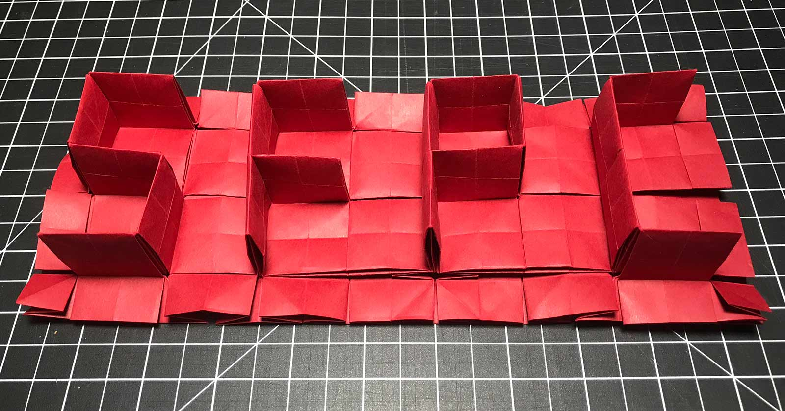

# Code-Paper-Scissors

### February, 2019 at the School for Poetic Computation

- 2 Week Session, Monday Feb 4th - Sunday Feb 17th
- @ SFPC, 155 Bank street, West Village, NYC
- 6:30pm - 9:30pm, Monday to Friday

# Teachers

- Kelli Anderson
- Simon Arizpe
- Coralie Gourguechon
- Robby Kraft
- Pam Liou

[Readings, Homework, Resources](https://robbykraft.dropmark.com/630690)

# Outline

*How does our understanding of technology change when abstractions become tangible? In this course, paper acts as a bridge between code, mathematics, and our human sensory experience of the world.*

Course objectives:

- learn how folding can be used to augment or replace traditional engineering methods
- foundational methods in kirigami and pop-ups
- contemporary origami design from uniaxial bases to software based computational flat-foldability
- an introduction to silkscreened electronics
- an introduction to prototyping methods, manufacturing, code-based modeling and testing strategies, how to: graphic design for 3-D forms

# Classes

## Introduction

*Robby, Kelli, Coralie, and Taeyoon Choi*

> Monday, Feb. 4

Preparatory Homework
- Watch: “The Origami Revolution” and Ron Resch’s “Paper and Stick Film”
- Install:  Plotter software (Craft Robo Cutting Master 3 or 4 - plugin for Adobe Illustrator)

In this introduction, Taeyoon will introduce the class, give context for SFPC’s mission and history, and discuss logistics  Three of the Code-Paper-Scissors instructors will introduce themselves, their work, and the ground they will cover:

- Robby: origami, math history, software 
- Coralie: paper electronics
- Kelli: design, paper-engineering, function from structure

We'll spend time getting to know our fellow students, the space, the plotter, the tools, and the wall of cut/fold pattern dielines and templates. We will finish the evening with our first origami activity and an introduction to crease patterns.

## Origami Design 1: Flat-foldability and uniaxial bases

*Robby*

> Tuesday, Feb. 5

[syllabus](https://paper.dropbox.com/doc/Origami-Design-1--AWnpyO25FCHwsHAJjaT94rbkAQ-8igCiI3wEzS3887lUpEiA)

In this class, Robby Kraft will cover 3 approaches to origami design:

- modifying existing designs
- free-form design by concave-hull wrapping
- circle river uniaxial-bases

Robby will introduce concepts briefly with a slideshow and will lead hands-on exploration of each concept. A secondary aim of this class is to introduce students to developing an artistic intuition in origami: how to optimize use of material and how to navigate forks in the road to best prevent a dead-end.

Sources:

- [Robert Lang - Origami Design Secrets](https://www.amazon.com/Origami-Design-Secrets-Mathematical-Methods/dp/1568814364/)
- [Erik Demaine, Joseph O'Rourke - Geometric Folding Algorithms](https://www.amazon.com/Geometric-Folding-Algorithms-Linkages-Polyhedra/dp/0521857570)

**Homework**: Finish folding the Riso Muira Ori, bring tomorrow

**Homework**: short Kenya Hara reading and “Kill Math”

## Paper as an Interface on the world, Paper Gadgets

*Kelli*

> Wednesday, Feb. 6

When tech is made physical it becomes radically accessible. In this class, we will discuss a multitude of wants that paper can make difficult abstractions tangible and help us observe the delicate physical forces of the world around us.

## The Fundamentals of Pop-ups

*Simon*

> Thursday, Feb. 7

In this hands-on workshop, students will learn the essential structures of paper engineering and pop-ups by creating their own textbooks. They will then apply what they have learned towards designing and building their own pop-ups.  During this section, students will be familiarized with the tools and techniques used in the field by building examples of mechanisms for themselves while gaining a basic understanding of pop-up book design.

## The Fundamentals of Pop-ups and History of Computers

*Simon, Pam*

> Friday, Feb. 8

In the second section of pop-up fundamentals, we will explore combinations of the different mechanisms learned at the start of the course. Pam will discuss the history of paper tape, punchcards, and paper computers.

## Origami Design 2: tessellations, rigid folding, software

*Robby*

> Monday, Feb. 11

This class will be covered in three parts. The first section is all about the hard parts of origami, beginning with the frontiers of origami: curved creases and crumpling. We'll discuss what makes this hard and and why there are unsolved problems. Discuss what *is* easily solvable leads us into origami software and we'll take a look under the hood of Rabbit Ear. Again, we'll look at some difficult problems in origami software and what makes them hard. We'll end this section with a demonstration of how to create a crease pattern in code and render it in Origami Simulator.

The second component begins with an introduction to origami tessellations, followed by a workshop where we create our own tiling. Students will be able to prototype a design and perform their own foldability tests.

The final component is an introduction to rigid folding and a look at software by Tomohiro Tachi: Freeform Origami, and Origamizer. We'll look at the "algorithm that can make anything" (Tachi, Demaine), and an exercise in a collapsable cardboard creation.

Sources:

- [Robert Lang - Twists, Tilings, and Tessellations](https://www.amazon.com/Twists-Tilings-Tessellations-Mathematical-Geometric/dp/1568812329/)
- [Tachi, Demaine - Origamizier Algorithm](https://pdfs.semanticscholar.org/758b/3b9cea1b8391a73ff68846011c7f480fe7a0.pdf)

## Make a Functional pop-up paper camera

*Kelli*

> Tuesday, Feb. 12

In this class, we will transform a flat piece of paper into a functional pinhole camera, while learning how light works. You can then use your camera with photo paper (provided) to take large-format pictures—which you can develop in instant coffee and baking soda. 

The classroom will temporarily be converted into a camera obscura, so we can observe light’s behavior from both inside and outside of the black box.

**Homework**: read [SparkFun Electronics primer](https://learn.sparkfun.com/tutorials/what-is-electricity/all)

## Electronics

*Coralie, Pam*

> Wednesday, Feb. 13

In this workshop, we will use paper electronics to rebuild common components with paper. We will first explore paper circuits, make a light turn on and off, and then make a radial potentiometer. At the end of the class, we will learn how speakers work and make a fully-functional paper speaker. How can we incorporate structure to bend, extend, or alter these projects’ functionality?

## Interfaces

*Coralie*

> Thursday, Feb. 14

In this class, we will rethink gestures to interact with paper interfaces and construct a paper synthesizer. We will start with reimagine what a graphic-based interface can be and what kinds of interaction does it offer? (Does it isolating notes? Will it allow for sliding sounds? Or randomness? Or for chords to be played?)  How does structure dictate how the instrument must be played?

---

**header image was designed using the [orthogonal maze algorithm by Erik Demaine, Martin Demaine, Jason Ku](http://erikdemaine.org/fonts/maze/?text=SFPC)**